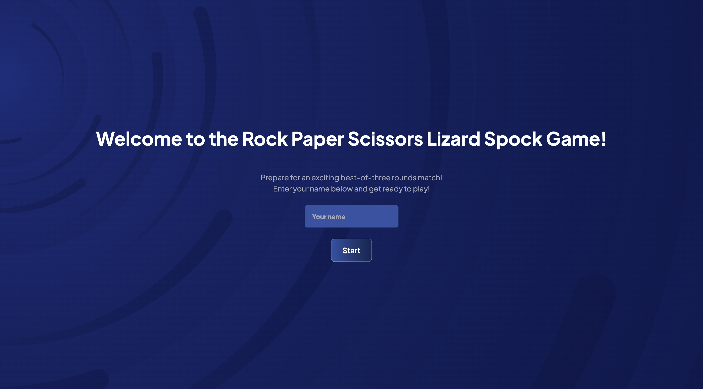
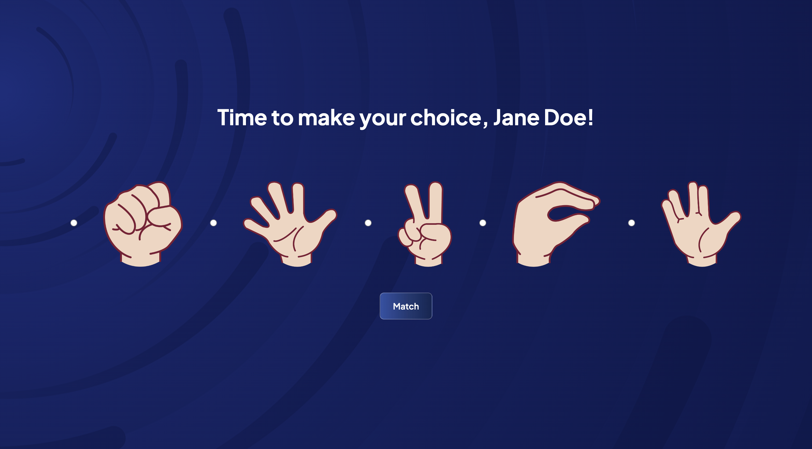
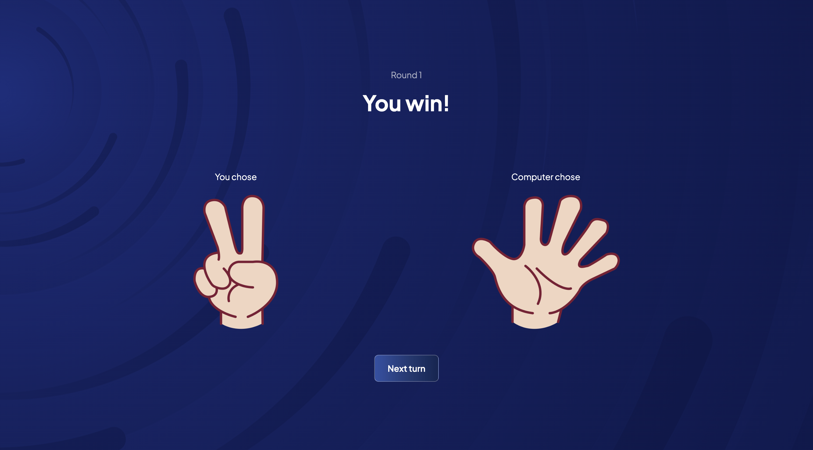
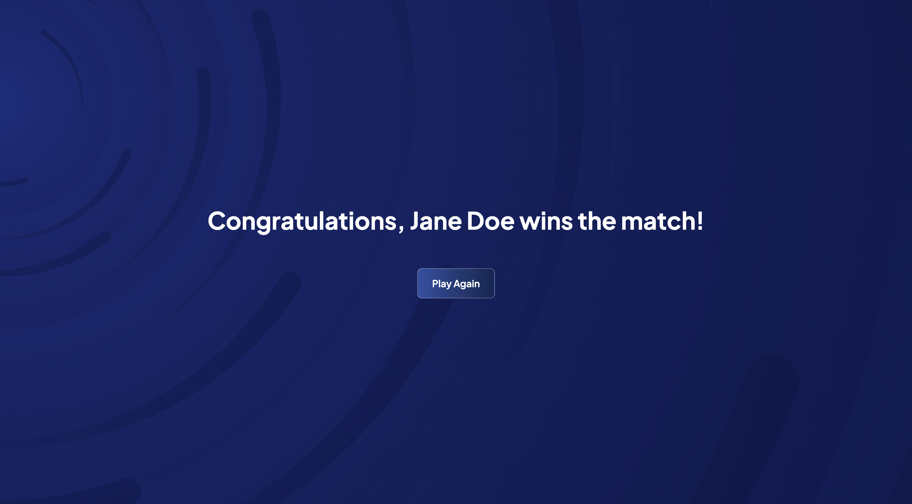

# Rock Paper Scissors Challenge

## Overview

A game of Rock Paper Scissors, but with an added twist. Choose from five distinct options: Rock, Paper, Scissors, Lizard, and Spock. Compete against the computer in a best-of-three match to determine the ultimate champion. 

## Built with
[](https://getbootstrap.com/)
[](https://ejs.co/)
[](https://expressjs.com/)
[](https://mochajs.org/)
[](https://www.chaijs.com/)


## Getting Started

1. Clone this repository to your local machine.

2. Navigate to the project's root directory and install the necessary dependencies by running the following command:
   ```sh
   $ npm install
   ```

3. Run the tests using the following command:
   ```sh
   $ npm test
   ```

4. Give the game a go using the following command:
   ```sh
   $ npm start
   ```

## Domain Model

| Object          | Properties   | Methods                                      | Output  |
|-----------------|--------------|--------------------------------------------- |-------- |
| Match           | roundsPlayed | setup(playerName)                            | @void   |
|                 | playerWins   | getRoundWinner(playerOption, computerOption) | @string |
|                 | computerWins | getMatchWinner()                             | @string |
|                 | ties         | reset()                                      | @void   |
| Player          | name         | -                                            | @void   |
| ComputerPlayer  | -            | chooseOption()                               | @string |


## Application Data Flow Schema

| Description                      | Method    | Route        | Data Response                                          |
|----------------------------------|-----------|--------------|--------------------------------------------------------|
| Display home page                | GET       | /            | Renders index.ejs                                      |
| Start match and set up player    | POST      | /game        | Redirects to /game                                     |
| Display game interface           | GET       | /game        | Renders game.ejs with player's name                    |
| Play a round and display outcome | POST      | /outcome     | Renders outcome.ejs with round result, player's choice |
| Display match result             | GET       | /matchResult | Renders matchResult.ejs with match outcome             |
| Play again (return to game)      | GET       | /            | Redirects to /game and follows the same routes again   |                                   |


## Tests

### Index Route:
1. Test that it renders the index page successfully.
2. Test that it starts a new game when submitting the form.

### Game Route:
1. Test that it start a new match and redirects to the game page.
2. Test that the game page is rendered with the player name.

### Outcome Route:
1. Tets if the outcome page is rendered with correct data.

### Match Result Route:
1. Test if the match result page is rendered.

### Match Class:
1. Test that it creates a new match with a player and a computer.
2. Test that it correctly identifies round player wins.
3. Test that it correctly identifies round computer wins.
4. Test that it correctly handles a round tie scenario.
5. Test that it correctly determines the match winner for different scenarios.
6. Test if it resets match state to initial values after playing a match of 3 rounds.

### Player Class:
1. Test that it creates a player with the given name.

### Computer Player Class:
1. Test that computer chooses an option from available choices.

> **Note:** I intended to write additional tests, but I recognised the need and importance to dedicate some time to review the material covered in the previous weeks. This is to prepare for both the upcoming Chitter challenge and team engineering project. 

## Game Preview

Below are some images that show how the game UI:

<div style="display: flex; justify-content: center;">
    <div style="text-align: center; margin-right: 10px;">
        <figure>
            
            <figcaption>Home Page</figcaption>
        </figure>
    </div>
    <div style="text-align: center; margin-left: 10px;">
        <figure>
            
            <figcaption>Game Page</figcaption>
        </figure>
    </div>
</div>

<div style="display: flex; justify-content: center;">
    <div style="text-align: center; margin-right: 10px;">
        <figure>
            
            <figcaption>Round Result Page</figcaption>
        </figure>
    </div>
    <div style="text-align: center; margin-left: 10px;">
        <figure>
            
            <figcaption>Match Result Page</figcaption>
        </figure>
    </div>
</div>

## Acknowledgments
- Ed's videos
- [Chai Documentation for Usage](https://github.com/chaijs/chai)
- Adding [images and styling](https://stackoverflow.com/questions/17755147/displaying-an-image-with-ejs-in-node-js-express) in ejs
- [Bootstrap Documentation](https://getbootstrap.com/docs/5.3/getting-started/introduction/)
- [Google Fonts](https://fonts.google.com/)
- [Background SVG](https://www.svgbackgrounds.com/set/free-svg-backgrounds-and-patterns/)
- [GitHub Badges](https://dev.to/envoy_/150-badges-for-github-pnk)

> **Note:** Personally designed the hand gesture illustrations.
